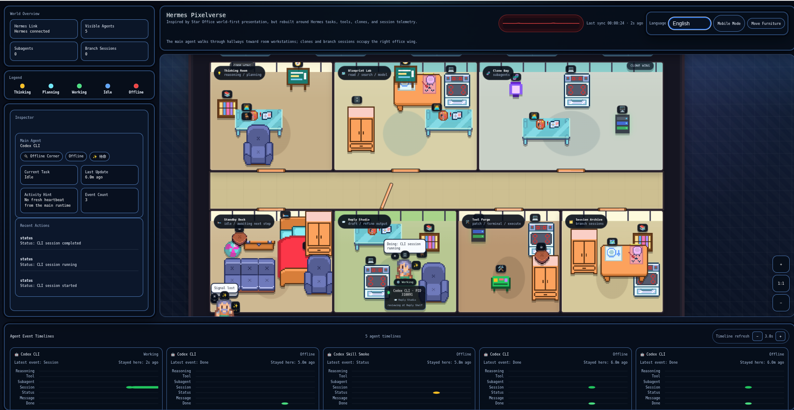

# Hermes Pixelverse

Pixelverse is a local visual observability UI for agent CLIs and Hermes/OpenWebUI workflows. It turns agent lifecycle events into a pixel-room scene so you can see when an agent is thinking, using tools, delegating work, answering, idle, or offline.



The service runs as a Docker Compose app and exposes:

- UI: `http://localhost:4321`
- Swagger API: `http://localhost:4321/docs`
- OpenAPI: `http://localhost:4321/openapi.json`
- World snapshot: `http://localhost:4321/api/world`
- Hermes hook bridge: `http://localhost:4567/hook`

## What It Supports

Pixelverse has two integration styles.

1. Generic HTTP events
   - Any agent can `POST /api/event`.
   - This is the most reliable integration for custom tools and scripts.

2. CLI shims
   - `codex`
   - `gemini`
   - `claude`
   - `ollama`
   - `hermes`
   - The shim forwards to the real CLI and mirrors process-level lifecycle events to Pixelverse.

Hermes has an additional hook adapter for gateway lifecycle events. If you use Hermes through OpenWebUI, the Hermes API server also needs a relay patch so its `tool_progress_callback` events are mirrored to Pixelverse.

Hermes also installs a user plugin under `~/.hermes/plugins/pixelverse`. That plugin is the important path for direct `hermes chat` sessions because it observes Hermes `pre_llm_call`, `post_llm_call`, `pre_tool_call`, and `post_tool_call` hooks even when your shell is running the original Hermes binary instead of the Pixelverse CLI shim.

## Quick Start

### 1. Start Pixelverse

```bash
git clone <your-repo-url> hermes-pixelverse
cd hermes-pixelverse
chmod +x run.sh
PIXELVERSE_AGENT_KIND=codex ./run.sh down_up
```

Open:

```text
http://localhost:4321
```

The UI uses a fixed left operations sidebar on desktop and a full-width agent timeline along the bottom. Use the top-right `Mobile Mode` button on phones; mobile mode keeps the world readable and exposes the left drawer through a compact `>` / `<` edge handle. The world viewport supports mouse drag panning, wheel zoom, and `+ / 1:1 / -` controls.

### 2. Attach A Native CLI

Pixelverse does not overwrite or modify native agent CLI binaries. It creates local wrapper commands under `.pixelverse-service/bin/`.

Install the adapter for the currently selected agent:

```bash
./run.sh adapter
```

Or install one explicitly:

```bash
./run.sh adapter codex
./run.sh adapter gemini-cli
./run.sh adapter claude-code
./run.sh adapter ollama
./run.sh adapter hermes
```

Enable native command interception in the current shell:

```bash
source .pixelverse-service/activate.sh
```

Enable interception automatically for newly opened Bash terminals:

```bash
./run.sh enable-shell-adapter
```

Then run your normal CLI command:

```bash
codex
gemini
claude
ollama list
hermes chat
```

Start a new CLI process after activation. Pixelverse cannot retroactively attach to a CLI process that was already running before `source .pixelverse-service/activate.sh`.

While a wrapped CLI process is running, its adapter sends a heartbeat every 15 seconds. This keeps the UI synchronized with long-running Codex, Gemini CLI, Claude Code, Ollama, and Hermes sessions instead of letting the character become stale after the default 45-second timeout. Wrapper heartbeats use `preserve_phase=true`: they refresh liveness without replacing a newer planning, reasoning, or tool route.

Each wrapped CLI process gets a separate PID-backed identity such as `codex-cli:12345`. Codex also reads the repo-local `.codex/hooks.json` lifecycle adapter. The first time Codex opens this project, use `/hooks` to review and trust the project hook definition; after that, supported tool, subagent, and explicit `$skill` prompt events are relayed automatically.

If you do not want to modify `PATH`, call the explicit Pixelverse wrapper instead:

```bash
./.pixelverse-service/bin/pixelverse-codex
./.pixelverse-service/bin/pixelverse-gemini
./.pixelverse-service/bin/pixelverse-claude
./.pixelverse-service/bin/pixelverse-ollama list
./.pixelverse-service/bin/pixelverse-hermes chat
```

For Hermes only, `./run.sh adapter hermes` also installs a user plugin at `~/.hermes/plugins/pixelverse` so direct `hermes chat` can emit deeper LLM/tool lifecycle events without changing Hermes source code.

Check service state:

```bash
./run.sh status
./run.sh bridge-status
```

Send a synthetic route test:

```bash
./run.sh test-hook
```

Force a specific test room:

```bash
PIXELVERSE_TEST_HOOK_TARGET=tool_forge ./run.sh test-hook
PIXELVERSE_TEST_HOOK_TARGET=clone_bay ./run.sh test-hook
```

## Service Commands

```bash
./run.sh start
./run.sh stop
./run.sh restart
./run.sh down_up
./run.sh status
./run.sh log
./run.sh doctor
./run.sh bridge-status
./run.sh adapter
./run.sh --help
```

`start`, `restart`, and `down_up` ask you to choose an agent source with arrow keys unless `PIXELVERSE_AGENT_KIND` is set:

```bash
PIXELVERSE_AGENT_KIND=codex ./run.sh down_up
PIXELVERSE_AGENT_KIND=gemini-cli ./run.sh down_up
PIXELVERSE_AGENT_KIND=claude-code ./run.sh down_up
PIXELVERSE_AGENT_KIND=ollama ./run.sh down_up
PIXELVERSE_AGENT_KIND=hermes ./run.sh down_up
```

Supported values:

- `codex`
- `gemini-cli`
- `claude-code`
- `ollama`
- `hermes`
- `generic`

When an agent kind is selected, `run.sh` also installs the matching local adapter shim under:

```text
.pixelverse-service/bin/
```

`down_up` reuses the existing local Docker image when `hermes-pixelverse:local` already exists. This avoids failing on restart when Docker Hub or DNS is temporarily unavailable. Force a rebuild only when needed:

```bash
PIXELVERSE_REBUILD=1 PIXELVERSE_AGENT_KIND=hermes ./run.sh down_up
```

## CLI Adapter Setup

Short form:

```bash
./run.sh adapter
./run.sh adapter codex
./run.sh adapter gemini-cli
./run.sh adapter claude-code
./run.sh adapter ollama
./run.sh adapter hermes
./run.sh adapter all
```

Install all shims:

```bash
./run.sh install-adapter all
```

Install one shim:

```bash
./run.sh install-adapter codex
./run.sh install-adapter gemini-cli
./run.sh install-adapter claude-code
./run.sh install-adapter ollama
./run.sh install-adapter hermes
```

Use explicit Pixelverse wrapper commands:

```bash
./.pixelverse-service/bin/pixelverse-codex --version
./.pixelverse-service/bin/pixelverse-gemini --help
./.pixelverse-service/bin/pixelverse-claude --help
./.pixelverse-service/bin/pixelverse-ollama list
./.pixelverse-service/bin/pixelverse-hermes chat
```

To make normal CLI commands observable in the current shell, prepend the shim directory:

```bash
source .pixelverse-service/activate.sh
```

Then use the CLIs normally:

```bash
codex
gemini
claude
ollama list
hermes chat
```

The shim searches for the original command by removing `.pixelverse-service/bin` from `PATH`, then running `command -v`. If the original CLI is in a custom location, set an explicit command path:

```bash
PIXELVERSE_CODEX_COMMAND=/absolute/path/to/codex codex
PIXELVERSE_GEMINI_COMMAND=/absolute/path/to/gemini gemini
PIXELVERSE_CLAUDE_COMMAND=/absolute/path/to/claude claude
PIXELVERSE_OLLAMA_COMMAND=/absolute/path/to/ollama ollama list
PIXELVERSE_HERMES_COMMAND=/absolute/path/to/hermes hermes chat
```

The shims are best-effort. If Pixelverse is not running, they print a short warning and still run the original CLI.

The adapter is intentionally non-invasive:

- It does not replace `/usr/local/bin`, `~/.local/bin`, npm global binaries, or installed agent repos.
- It only creates files inside this repo's `.pixelverse-service/bin/`.
- It affects shells after `source .pixelverse-service/activate.sh`, new Bash shells after `./run.sh enable-shell-adapter`, or explicit `pixelverse-*` wrapper calls.
- For Hermes, the optional user plugin lives in `~/.hermes/plugins/pixelverse` and can be removed by deleting that folder.

## MCP Onboarding Tool

Pixelverse includes a dependency-free stdio MCP server for third-party agent onboarding:

```text
scripts/pixelverse_mcp_server.py
```

The MCP layer is a DX wrapper. It does not replace the stable HTTP bridge protocol. Agent state still flows through:

```text
MCP tool or CLI adapter -> POST /api/event or POST /api/heartbeat -> Pixelverse world state -> SSE UI
```

After cloning this repository, register the MCP server in your MCP-capable client. Use an absolute repository path:

```json
{
  "mcpServers": {
    "pixelverse": {
      "command": "python3",
      "args": [
        "/absolute/path/to/hermes-pixelverse/scripts/pixelverse_mcp_server.py"
      ]
    }
  }
}
```

Then ask the client to call:

```text
pixelverse_onboard {"agent_kind":"codex"}
```

This installs the selected adapter, runs `./run.sh bridge-status`, and returns the shell activation command:

```bash
source .pixelverse-service/activate.sh
```

Available MCP tools:

| Tool | Purpose |
| --- | --- |
| `pixelverse_onboard` | One-click adapter install plus bridge status and activation guidance |
| `pixelverse_install_adapter` | Wrap `./run.sh install-adapter <target>` |
| `pixelverse_bridge_status` | Wrap `./run.sh bridge-status` |
| `pixelverse_emit_event` | Emit a standardized lifecycle event through the existing HTTP bridge |

Example lifecycle event call:

```text
pixelverse_emit_event {
  "agent_type": "codex",
  "agent": "codex-main",
  "event": "tool.started",
  "tool_names": ["terminal", "patch"],
  "target_room": "tool_forge",
  "message": "Updating project files"
}
```

Safety notes:

- `pixelverse_onboard` defaults to `generic`; choose the actual agent kind explicitly when possible.
- `codex`, `gemini-cli`, `claude-code`, `ollama`, and `generic` create repo-local adapter files.
- `hermes`, `hermes-hook`, `hermes-plugin`, and `all` may also install files under `~/.hermes/`.
- The MCP server uses Python standard library code and the existing Pixelverse client, so no MCP SDK package is required.

Manual stdio smoke test:

```bash
printf '%s\n' \
  '{"jsonrpc":"2.0","id":1,"method":"initialize","params":{"protocolVersion":"2025-06-18","capabilities":{},"clientInfo":{"name":"manual-test","version":"0.1.0"}}}' \
  '{"jsonrpc":"2.0","method":"notifications/initialized"}' \
  '{"jsonrpc":"2.0","id":2,"method":"tools/list"}' \
  | python3 scripts/pixelverse_mcp_server.py
```

## Hermes Integration

For Hermes CLI:

```bash
cd /path/to/hermes-pixelverse
PIXELVERSE_AGENT_KIND=hermes ./run.sh down_up
./run.sh install-adapter hermes
export PATH="$PWD/.pixelverse-service/bin:$PATH"
hermes chat
```

If you do not want to modify `PATH`, launch through the explicit wrapper:

```bash
./run.sh hermes-chat
```

`./run.sh install-adapter hermes` installs three Hermes integrations:

- CLI shim: `.pixelverse-service/bin/hermes`
- Gateway hook: `~/.hermes/hooks/pixelverse`
- Direct CLI user plugin: `~/.hermes/plugins/pixelverse`

After installing the plugin, restart any already-running `hermes chat` session so Hermes reloads plugins. Inside a Hermes chat session, this slash command should trigger a visible Pixelverse event:

```text
/pixelverse-status
```

For Hermes gateway hooks:

```bash
cd /path/to/hermes-pixelverse
./run.sh install-adapter hermes-hook
```

This installs:

```text
~/.hermes/hooks/pixelverse/HOOK.yaml
~/.hermes/hooks/pixelverse/handler.py
```

Restart Hermes/OpenWebUI after installing the hook:

```bash
cd /home/a0665x/Desktop/AI_AGX_WS/HermesAgent_OpenWebUI
./run.sh hermes-start
```

The hook posts to:

```text
http://localhost:4567/hook
```

For OpenWebUI through Hermes API server, Hermes must relay API-server `tool_progress_callback` events to Pixelverse. This project documents that integration in `spec/modules/integration-and-events.md`; if your Hermes repo does not include that relay, the UI will show Hermes API health but not real OpenWebUI tool movement.

## Generic HTTP API

Minimal tool event:

```bash
curl -X POST http://localhost:4321/api/event \
  -H 'Content-Type: application/json' \
  -d '{"agent_type":"codex","agent":"codex-main","name":"Codex","event":"tool.started","tool_name":"terminal","message":"running a command"}'
```

Start:

```bash
curl -X POST http://localhost:4321/api/event \
  -H 'Content-Type: application/json' \
  -d '{"agent_type":"gemini-cli","agent":"gemini-main","name":"Gemini","event":"start","state":"thinking","target_room":"think_lab","message":"planning"}'
```

Complete:

```bash
curl -X POST http://localhost:4321/api/event \
  -H 'Content-Type: application/json' \
  -d '{"agent_type":"claude-code","agent":"claude-main","name":"Claude","event":"completed","state":"idle","target_room":"standby_dock","message":"done"}'
```

Python client:

```bash
python3 -m agent_bridges.pixelverse_client start \
  --agent-type codex \
  --agent codex-main \
  --name Codex

python3 -m agent_bridges.pixelverse_client tool \
  --agent-type codex \
  --agent codex-main \
  --tool-names terminal,patch

python3 -m agent_bridges.pixelverse_client complete \
  --agent-type codex \
  --agent codex-main
```

## Room Routing

Explicit `target_room` wins. If omitted, the backend and adapters infer a room from tool or message text.

Each lifecycle phase is a route endpoint. The character stays at that endpoint until the next phase event: `start` routes to `think_lab`; reasoning or planning routes to `blueprint_lab`; `tool.started` and `tool.completed` remain active in the tool room; only an explicit session `completed`, `end`, or `state=idle` event returns the character to `standby_dock`. A `status` event without `state` preserves the current phase.

Common rooms:

- `think_lab`: planning or starting
- `blueprint_lab`: search, read, research, spec work
- `tool_forge`: terminal, patch, write, execute, browser
- `response_studio`: reply, draft, final answer
- `clone_bay`: subagent/delegation work
- `session_archive`: history/session/memory work
- `standby_dock`: completed or idle
- `offline_corner`: stale or failed

## Debug Artifacts

`./run.sh test-hook` overwrites these files:

```text
tmp/latest_test_hook_route.json
tmp/latest_world_snapshot.json
tmp/pixelverse_debug_log.json
tmp/local_ui_trajectory.jpg
```

Use them when checking room routing, A* pathing, door anchors, and multi-agent plans.

## Troubleshooting

Check all important probes:

```bash
./run.sh doctor
./run.sh bridge-status
docker logs --tail 120 hermes-pixelverse
```

If the UI is running but real agents stay idle:

1. Confirm synthetic events work:
   ```bash
   ./run.sh test-hook
   ```

2. Confirm the CLI shim is being used:
   ```bash
   export PATH="$PWD/.pixelverse-service/bin:$PATH"
   which codex
   which hermes
   ```

   For direct Hermes chat, also confirm the Hermes user plugin is installed:
   ```bash
   test -f ~/.hermes/plugins/pixelverse/plugin.yaml && echo pixelverse-plugin-ok
   ```

3. Confirm Pixelverse receives events:
   ```bash
   curl -fsS http://localhost:4321/api/world
   docker logs --tail 80 hermes-pixelverse
   ```

4. For Hermes/OpenWebUI, confirm Hermes API is healthy:
   ```bash
   curl -fsS http://localhost:8642/health
   ```

If `bridge-status` says Pixelverse is unavailable, start it:

```bash
PIXELVERSE_AGENT_KIND=hermes ./run.sh down_up
```

If direct CLI commands do not show in Pixelverse, use the explicit wrapper first:

```bash
./.pixelverse-service/bin/pixelverse-codex --version
./.pixelverse-service/bin/pixelverse-hermes chat
```

If the selected CLI character becomes offline after about 45 seconds, the CLI process was not attached through the Pixelverse shim or its heartbeat is not reaching the API. Check the current shell:

```bash
./run.sh bridge-status
source .pixelverse-service/activate.sh
which codex
```

For Codex, `which codex` should resolve to:

```text
<repo>/.pixelverse-service/bin/codex
```

Then start a new Codex session. A Codex process that was already running before activation cannot be attached retroactively.

## Environment Variables

Service:

- `PIXELVERSE_AGENT_KIND`
- `PIXELVERSE_PORT`
- `MINIVERSE_BRIDGE_PORT`
- `PIXELVERSE_REBUILD`
- `PIXELVERSE_TAILSCALE_ENABLE`
- `PIXELVERSE_TAILSCALE_PORT`

CLI adapters:

- `PIXELVERSE_URL`
- `PIXELVERSE_CODEX_COMMAND`
- `PIXELVERSE_GEMINI_COMMAND`
- `PIXELVERSE_CLAUDE_COMMAND`
- `PIXELVERSE_OLLAMA_COMMAND`
- `PIXELVERSE_HERMES_COMMAND`
- `PIXELVERSE_HEARTBEAT_SECONDS`

MCP onboarding:

- `PIXELVERSE_URL`

Hermes:

- `HERMES_HOME`
- `HERMES_REPO`
- `MINIVERSE_BRIDGE_URL`

## Development Checks

```bash
bash -n run.sh
python3 -m py_compile agent_bridges/*.py
python3 -m py_compile scripts/pixelverse_mcp_server.py
python3 -m pytest -q -o faulthandler_timeout=10
node --test tests/*.mjs
```

## Repository Map

- `run.sh`: service and adapter command surface
- `docker-compose.yml`: Docker service
- `pixelverse_fastapi.py`: FastAPI app and Swagger API
- `pixelverse_server.py`: world state and agent lifecycle logic
- `bridge.py`: Hermes hook bridge
- `agent_bridges/`: generic client and CLI adapters
- `hooks/miniverse/`: Hermes hook payload relay
- `public/`: pixel world frontend
- `scripts/`: helper scripts and trajectory renderer
- `scripts/pixelverse_mcp_server.py`: dependency-free stdio MCP onboarding server
- `spec/`: architecture, module, and integration notes
- `tests/`: Python and Node tests

## License Notes

Pixel assets are stored under `public/assets/` with their own license notes. Check bundled license files before redistributing modified asset packs.
