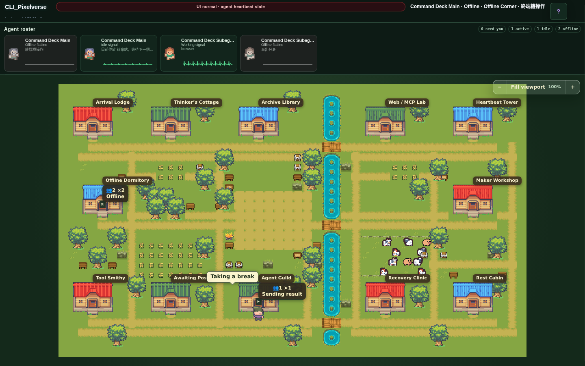
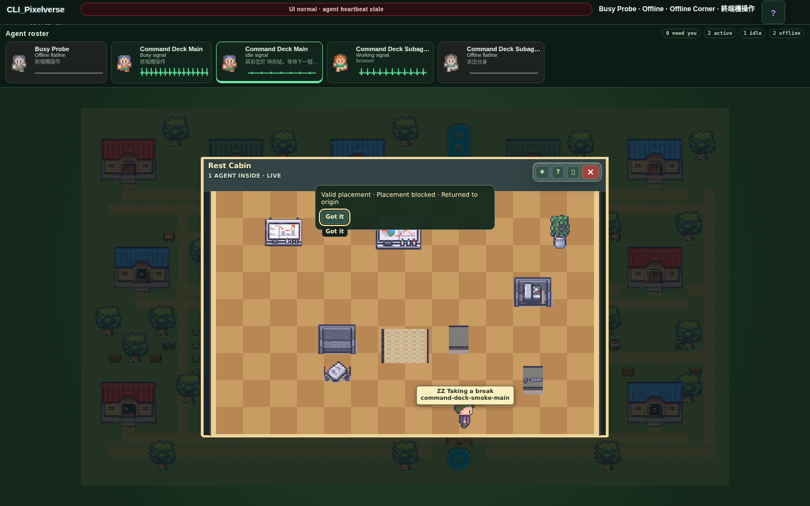

# CLI_Pixelverse

CLI_Pixelverse is a local visual observability UI for agent CLIs. It turns
agent lifecycle events into a pixel-room scene so you can see when a CLI is
thinking, using tools, delegating work, answering, idle, or offline.






The service runs as a Docker Compose app and exposes:

- UI: `http://localhost:5660`
- Swagger API: `http://localhost:5660/docs`
- OpenAPI: `http://localhost:5660/openapi.json`
- World snapshot: `http://localhost:5660/api/world`
- Hook bridge: `http://localhost:4567/hook`

## What It Supports

CLI_Pixelverse has two integration styles.

1. Generic HTTP events
   - Any agent can `POST /api/event`.
   - This is the most reliable integration for custom tools and scripts.

2. CLI shims
   - `codex`
   - `gemini`
   - `claude`
   - `antigravity`
   - `ollama`
   - `hermes`
   - The shim forwards to the real CLI and mirrors process-level lifecycle events to Pixelverse.

Hermes has an additional hook adapter for gateway lifecycle events. The `4567/hook` relay stays available even when the selected primary agent is Codex, Gemini CLI, Claude Code, Antigravity, Ollama, or generic. In those modes it runs relay-only and does not create a Hermes avatar until a Hermes gateway event arrives. If you use Hermes through OpenWebUI, the Hermes API server also needs a relay patch so its `tool_progress_callback` events are mirrored to Pixelverse.

Hermes also installs a user plugin under `~/.hermes/plugins/pixelverse`. That plugin is the important path for direct `hermes chat` sessions because it observes Hermes `pre_llm_call`, `post_llm_call`, `pre_tool_call`, and `post_tool_call` hooks even when your shell is running the original Hermes binary instead of the Pixelverse CLI shim.

The Hermes gateway relay uses its own `PIXELVERSE_BRIDGE_AGENT_ID` identity (default: `henry-main`). This prevents a `run.sh` invocation launched from inside an already-wrapped Codex process from reusing the Codex CLI identity for Hermes gateway events.

## Platform Support And Project Hooking

The standard `./run.sh` flow supports native 64-bit Intel/AMD and ARM hosts:

- `x86_64` / `amd64` builds and runs `linux/amd64`.
- `aarch64` / `arm64` builds and runs `linux/arm64`.

Docker's multi-architecture Node and Python base images supply the matching
runtime automatically. Check the resolved target before the first build:

```bash
./run.sh platform
docker version
docker compose version
```

An intentional emulated/cross-platform build can override the target:

```bash
PIXELVERSE_DOCKER_PLATFORM=linux/arm64 PIXELVERSE_AGENT_KIND=codex ./run.sh down_up
```

The Codex project hook invokes `python3` through `/usr/bin/env`, so it is not
tied to an x86-specific interpreter path. To connect a different repository to
an already running CLI_Pixelverse service:

```bash
export PIXELVERSE_ROOT=/path/to/CLI_Pixelverse
cd /path/to/other-project
"$PIXELVERSE_ROOT/run.sh" install-codex-hook "$PWD"
source "$PIXELVERSE_ROOT/.pixelverse-service/activate.sh"
codex
```

The activation wrapper supplies process presence and heartbeat from any
directory. Installing the project hook additionally supplies prompt, tool,
subagent, and stop events for that repository. Run `/hooks` once in the first
Codex session for that project and trust the generated project hook.

During `start`/`down_up`, project-local hook installation is best effort: a
read-only checkout still starts the service and installs the CLI adapter. Use
the explicit `install-codex-hook` command later from a writable project root if
you want the richer tool/subagent events. The explicit command reports a
failure instead of silently skipping it.

## Bootstrap Quick Start

For a fresh clone, this is the shortest reliable setup path. Codex is the
default because it has the deepest project-hook integration.

### Licensed Modern Office prerequisite

The village uses the paid
[Modern Office - Revamped - RPG Tileset](https://limezu.itch.io/modernoffice)
for its furniture. Purchase and download the pack yourself; the license does
not permit this repository to redistribute it.

From the root of your own clone, create the private input directory:

```bash
mkdir -p private_assets/modern-office
```

Place the downloaded ZIP at this exact clone-relative path:

```text
private_assets/modern-office/Modern_Office_Revamped_v1.zip
```

If the ZIP already lives elsewhere, leave it there and use a portable absolute
override instead:

```bash
PIXELVERSE_MODERN_OFFICE_ZIP=/absolute/path/to/Modern_Office_Revamped_v1.zip ./run.sh start
```

Otherwise the normal first start is enough:

```bash
./run.sh start
```

`start` validates the ZIP, prepares all 339 furniture sprites and their local
alpha-collision manifest, and builds the complete local image. A missing,
partial, corrupt, or wrong-version pack stops before Docker Compose instead of
showing black furniture placeholders. After preparation, inspect the local
state with:

```bash
./run.sh assets-status
```

Later, `./run.sh restart` reuses the saved agent choices and rebuilds
only when source files or prepared-asset metadata changed. Direct
`docker compose build` is unsupported until `run.sh` has prepared the private
assets.

The ZIP, extracted PNGs, generated collision manifest, and prepared directory
are Git-ignored. The locally built image contains the licensed sprites: do not
commit these files, redistribute them, or push that image to a public registry.

### Once per Pixelverse clone

```bash
git clone https://github.com/a0665x/CLI_Pixelverse.git
cd CLI_Pixelverse
mkdir -p private_assets/modern-office
# Place Modern_Office_Revamped_v1.zip in the directory above.
PIXELVERSE_AGENT_KIND=codex ./run.sh start
source "$(pwd -P)/.pixelverse-service/activate.sh"
codex
```

For portable commands from another directory, save the clone location in the
current shell:

```bash
export PIXELVERSE_ROOT="$(pwd -P)"
```

`PIXELVERSE_ROOT` belongs to the current shell. Set it again after opening a
new shell, or use the optional automatic activation below.

### Once per target repository

Install high-fidelity Codex prompt, tool, subagent, and stop hooks in every
repository that should appear in Pixelverse:

```bash
cd /path/to/your-project
"$PIXELVERSE_ROOT/run.sh" install-codex-hook "$PWD"
```

If `.codex/hooks.json` already exists, the installer preserves unknown fields
and custom hooks, creates a timestamped backup, and adds only missing
Pixelverse entries. Repeated installation is idempotent. Malformed JSON or a
conflicting Pixelverse command stops with an error and leaves the original
file unchanged. In the first Codex session for that repository, run `/hooks`
and trust the project hook definition.

### Once per current shell

```bash
source "$PIXELVERSE_ROOT/.pixelverse-service/activate.sh"
command -v codex
"$PIXELVERSE_ROOT/run.sh" status
"$PIXELVERSE_ROOT/run.sh" bridge-status
codex
```

Activation affects only CLI processes started afterward; Pixelverse cannot
retroactively attach to an already-running Codex process.

### Optional automatic activation for new Bash shells

```bash
"$PIXELVERSE_ROOT/run.sh" enable-shell-adapter
```

This writes a managed activation block for future Bash shells. It does not
replace the original Codex executable.

Open:

```text
http://localhost:5660
```

`down_up` in Codex mode starts the Docker service, installs the Codex CLI shim,
attempts to create this repo's
`.codex/hooks.json`, enables the managed Bash activation line for new terminals,
and writes `.pixelverse-service/activate.sh`.

Verify the local connection:

```bash
bash -lc 'source "$PIXELVERSE_ROOT/.pixelverse-service/activate.sh" && command -v codex'
curl -fsS http://127.0.0.1:5660/health
curl -fsS http://127.0.0.1:4567/health
curl -fsS http://127.0.0.1:5660/api/world
./run.sh test-hook
```

Expected:

- `command -v codex` resolves to `.pixelverse-service/bin/codex`.
- `5660/health` and `4567/health` are available.
- `./run.sh test-hook` moves an agent in the UI.
- The first Codex session in a repo should run `/hooks` and trust the project hook.

Check Tailscale before using remote exposure:

```bash
command -v tailscale
tailscale status
tailscale serve status
```

If Tailscale is missing, install and authenticate it:

```bash
curl -fsSL https://tailscale.com/install.sh | sh
sudo tailscale up
```

If Tailscale is available and you want remote UI exposure:

```bash
PIXELVERSE_AGENT_KIND=codex PIXELVERSE_EXPOSURE_MODE=tailscale ./run.sh down_up
./run.sh status
```

After the shell adapter is enabled, a new terminal can start a process-level
Pixelverse-connected Codex session from any directory:

```bash
codex
```

For an already-open shell:

```bash
source "$PIXELVERSE_ROOT/.pixelverse-service/activate.sh" && codex
```

For another repo that also needs high-fidelity Codex tool/subagent events:

```bash
cd /path/to/other-repo
"$PIXELVERSE_ROOT/run.sh" install-codex-hook "$PWD"
codex
```

Connection rule:

- `codex` from any directory is enough for process-level presence, heartbeat, start, stop, and stale/offline tracking once the shell adapter is active.
- `"$PIXELVERSE_ROOT/run.sh" install-codex-hook "$PWD"` is required per repository when you also want Codex tool, prompt, subagent, and stop lifecycle events from that repository.
- In each repository where `.codex/hooks.json` is installed, run `/hooks` once inside Codex and trust the project hook.

## Using The Codex Skills

This repo includes two local Codex skills under `skill/`.

Use `$CLI_Pixelverse` when you want Codex to bootstrap a fresh clone or repair
local setup. It is the automation-oriented init skill: start the service,
install adapters, create hooks, enable shell activation, check Tailscale, and
verify status.

Example prompts:

```text
$CLI_Pixelverse 請幫我初始化這個剛 clone 下來的 CLI_Pixelverse repo，安裝 adapter、建立 hook、檢查 Tailscale，最後回報狀態。
$CLI_Pixelverse 我在另一個 repo 也想讓 Codex 連到 Pixelverse，請幫我建立 activate/hook 步驟並驗證。
```

Use `$pixelverse-onboarding` when you want Codex to understand the project and
explain or verify the existing setup without necessarily running the whole
bootstrap flow. It is better for architecture handoff, lifecycle routing,
adapter behavior, and hook troubleshooting.

Example prompts:

```text
$pixelverse-onboarding 請先讀 spec，幫我理解 CLI_Pixelverse 的架構與 hook 資料流。
$pixelverse-onboarding 請檢查目前 Codex hook/adapter 狀態，說明 Read/Edit/Bash 會怎麼映射到房間。
```

## Beginner Quick Start

Use Codex for the first setup because it currently has the deepest built-in
project hook integration. Gemini CLI, Claude Code, Antigravity, Ollama, Hermes, and generic
HTTP agents can be attached afterward.

### Codex First-Time Setup

Run this flow after cloning the repository:

```bash
cd /path/to/CLI_Pixelverse
export PIXELVERSE_ROOT="$(pwd -P)"

PIXELVERSE_AGENT_KIND=codex ./run.sh down_up
source "$PIXELVERSE_ROOT/.pixelverse-service/activate.sh"
./run.sh status
./run.sh bridge-status
which codex
codex
```

`which codex` must resolve to:

```text
<repo>/.pixelverse-service/bin/codex
```

Inside the first Codex session, run:

```text
/hooks
```

Codex mode automatically installs the local CLI shim, writes the git-ignored
`.codex/hooks.json` project hook for this repo, and enables the shell adapter
for newly opened Bash terminals. Review and trust that project hook definition.
Start a new Codex process after activation. A Codex process that was already
open before `source "$PIXELVERSE_ROOT/.pixelverse-service/activate.sh"` cannot be attached
retroactively.

The shell adapter writes a managed Bash startup line that
automatically sources `.pixelverse-service/activate.sh` in new terminals. The
activation file also preloads the important runtime variables:

- `PIXELVERSE_URL`
- `PIXELVERSE_BRIDGE_URL`
- `PIXELVERSE_STATE_DIR`

After that, a new terminal can usually start a hooked Codex session from any
directory with a single command:

```bash
codex
```

If you are already in an open shell, use the explicit one-liner:

```bash
source "$PIXELVERSE_ROOT/.pixelverse-service/activate.sh" && codex
```

For another repository, the wrapper gives you process-level lifecycle hooking
immediately. If you also want Codex tool/subagent events in that repo, install
the Codex project hook there too:

```bash
cd /path/to/other-repo
"$PIXELVERSE_ROOT/run.sh" install-codex-hook "$PWD"
codex
```

### Confirm The Connection

Open `http://localhost:5660`, then run:

```bash
./run.sh status
./run.sh bridge-status
which codex
curl -fsS http://localhost:5660/health
curl -fsS http://localhost:4567/health
curl -fsS http://localhost:5660/api/world
./run.sh test-hook
```

Expected results:

- `which codex` returns `<repo>/.pixelverse-service/bin/codex`.
- `5660/health` reports `"ok": true`.
- `4567/health` reports `"ok": true`.
- `./run.sh test-hook` makes the UI character move through lifecycle rooms.
- A newly opened Codex session appears as its own CLI-backed agent timeline.

The complete connection path is:

```text
Normal codex command
  -> repo-local .pixelverse-service/bin/codex wrapper
  -> periodic POST /api/heartbeat

Codex project lifecycle hooks
  -> .codex/hooks.json
  -> scripts/codex_pixelverse_hook.py
  -> POST /api/event

Pixelverse backend
  -> world state
  -> GET /api/world and SSE /api/world/stream
  -> browser UI room movement, timeline events, and per-agent heartbeat
```

### 1. Start Pixelverse

```bash
git clone https://github.com/a0665x/CLI_Pixelverse.git
cd CLI_Pixelverse
chmod +x run.sh
PIXELVERSE_AGENT_KIND=codex ./run.sh down_up
```

Open:

```text
http://localhost:5660
```

The UI uses a fixed left operations sidebar on desktop and a full-width agent timeline along the bottom. Use the top-right `Mobile Mode` button on phones; mobile mode keeps the world readable and exposes the left drawer through a compact `>` / `<` edge handle. The world viewport supports mouse drag panning, wheel zoom, and `+ / 1:1 / -` controls.

The dashboard includes a live hook state routing table. Village buildings and
their interiors show where each lifecycle phase is handled.

Furniture layouts are edited and saved per building from its interior. Open a
village building, choose **Move furniture**, then use **Save layout** after
dragging furniture or adding an item from the shelf.

### 2. Attach A Native CLI

Pixelverse does not overwrite or modify native agent CLI binaries. It creates local wrapper commands under `.pixelverse-service/bin/`.

Install the adapter for the currently selected agent:

```bash
./run.sh adapter
```

Or install one explicitly:

```bash
./run.sh adapter codex
./run.sh adapter gemini-cli
./run.sh adapter claude-code
./run.sh adapter ollama
./run.sh adapter hermes
```

When the service is started with `PIXELVERSE_AGENT_KIND=codex ./run.sh down_up`,
Pixelverse runs the Codex adapter setup and shell activation setup for you. To
add high-fidelity Codex hooks to another working directory, run this from that
directory:

```bash
"$PIXELVERSE_ROOT/run.sh" install-codex-hook "$PWD"
```

Enable native command interception in the current shell:

```bash
source "$PIXELVERSE_ROOT/.pixelverse-service/activate.sh"
```

Enable interception automatically for newly opened Bash terminals:

```bash
./run.sh enable-shell-adapter
```

Then run your normal CLI command from any directory:

```bash
codex
gemini
claude
ollama list
hermes chat
```

If you want the current shell to connect immediately without opening a new
terminal, use:

```bash
source "$PIXELVERSE_ROOT/.pixelverse-service/activate.sh" && codex
```

Start a new CLI process after activation. Pixelverse cannot retroactively attach to a CLI process that was already running before `source "$PIXELVERSE_ROOT/.pixelverse-service/activate.sh"`.

While a wrapped CLI process is running, its adapter sends a heartbeat every 15 seconds. This keeps the UI synchronized with long-running Codex, Gemini CLI, Claude Code, Antigravity, Ollama, and Hermes sessions instead of letting the character become stale after the default 45-second timeout. Wrapper heartbeats use `preserve_phase=true`: they refresh liveness without replacing a newer planning, reasoning, or tool route. Gemini CLI, Claude Code, Antigravity, and Ollama currently expose wrapper-level lifecycle only; Codex project hooks and the Hermes plugin/gateway hook add deeper tool-level events.

## Agent Hook Coverage

| Agent brand | Command shim | Native/project hook | Visual fidelity |
| --- | --- | --- | --- |
| Codex | `codex`, `pixelverse-codex` | Yes, repo-local `.codex/hooks.json` after `/hooks` trust | High: session, prompt, tool family, subagent start/stop, stop |
| Gemini CLI | `gemini`, `pixelverse-gemini` | Not currently installed by this repo | Low/medium: process start, heartbeat, complete/error; tools only if Gemini or user emits `/api/event` |
| Claude Code | `claude`, `pixelverse-claude` | Not currently installed by this repo | Low/medium: process start, heartbeat, complete/error; tools only if Claude or user emits `/api/event` |
| Antigravity | `antigravity`, `pixelverse-antigravity` | Not currently installed by this repo | Low/medium: process start, heartbeat, complete/error; tools only if Antigravity or user emits `/api/event` |
| Ollama | `ollama`, `pixelverse-ollama` | No CLI tool hook; model polling when selected | Wrapper lifecycle plus model availability/running status |
| Hermes | `hermes`, `pixelverse-hermes` | Yes through Hermes plugin/gateway hook when installed | Medium/high depending on direct CLI plugin or gateway/OpenWebUI relay |
| Generic | HTTP only | External system posts `/api/event` / `/api/heartbeat` | Depends on payload fidelity |

Gemini is treated as the official `gemini` command-line interface. After `source "$PIXELVERSE_ROOT/.pixelverse-service/activate.sh"`, `gemini` resolves to the Pixelverse shim first, then the shim executes the original official CLI binary.

Each wrapped CLI process gets a separate PID-backed identity such as `codex-cli:12345`. Codex also reads the locally generated, git-ignored `.codex/hooks.json` lifecycle adapter. The first time Codex opens this project, use `/hooks` to review and trust the project hook definition; after that, supported tool, subagent, and explicit `$skill` prompt events are relayed automatically.

## Codex Hook To UI State Map

The CLI wrapper and Codex project hooks have different responsibilities:

- The wrapper sends `POST /api/heartbeat` periodically so the UI knows the CLI process is still alive.
- The generated `.codex/hooks.json` sends lifecycle events through `scripts/codex_pixelverse_hook.py` so the UI knows what the CLI is doing.
- The backend translates lifecycle state into room routing and exposes the result through `/api/world` and `/api/world/stream`.

| Codex hook or condition | API event | Pixel state | Room | UI meaning |
| --- | --- | --- | --- | --- |
| CLI wrapper starts | heartbeat | `working` | current room | CLI process attached |
| Periodic wrapper heartbeat | heartbeat with `preserve_phase=true` | unchanged | unchanged | Refresh liveness only |
| `SessionStart` | `SessionStart` | `initializing` | `clone_bay` | New Codex session |
| `UserPromptSubmit` | `UserPromptSubmit` | `thinking` | `think_lab` | Reading the new request |
| Prompt contains explicit `$skill` or `/skill` | `skill.invoke` | `invoking_skill` | `tool_forge` | Skill requested explicitly |
| `PreToolUse` / `PostToolUse`: Read/Grep/Glob/LS | `tool.started` / `tool.completed` | `reading_files` | `file_library` | File read/search activity |
| `PreToolUse` / `PostToolUse`: Edit/MultiEdit/Write/apply_patch | `tool.started` / `tool.completed` | `editing_files` | `code_workbench` | File edit/write activity |
| `PreToolUse` / `PostToolUse`: Bash | `tool.started` / `tool.completed` | `shell_command` | `terminal_bay` | Shell command activity |
| `PreToolUse` / `PostToolUse`: Web/MCP/GitHub/browser tools | `tool.started` / `tool.completed` | `browsing` / `external_tool` | `tool_forge` | External tool activity |
| `SubagentStart` / `SubagentStop` | `subagent.started` / `subagent.stopped` plus main collaboration event | `collaborating` | `clone_bay` | Main agent dispatches clones; visual subagents stay in clone bay when idle |
| `Stop` | `completed` | `idle` | `standby_dock` | Current Codex turn completed |
| No fresh heartbeat past stale timeout | backend projection | `offline` | `offline_corner` | CLI closed or detached |

Internal skill reads that do not appear in the submitted user prompt cannot be
detected reliably by native Codex hooks. Only an explicit `$skill` or `/skill`
prompt maps to `invoking_skill`.

If you do not want to modify `PATH`, call the explicit Pixelverse wrapper instead:

```bash
./.pixelverse-service/bin/pixelverse-codex
./.pixelverse-service/bin/pixelverse-gemini
./.pixelverse-service/bin/pixelverse-claude
./.pixelverse-service/bin/pixelverse-antigravity
./.pixelverse-service/bin/pixelverse-ollama list
./.pixelverse-service/bin/pixelverse-hermes chat
```

For Hermes only, `./run.sh adapter hermes` also installs a user plugin at `~/.hermes/plugins/pixelverse` so direct `hermes chat` can emit deeper LLM/tool lifecycle events without changing Hermes source code.

Check service state:

```bash
./run.sh status
./run.sh bridge-status
```

Send a synthetic route test:

```bash
./run.sh test-hook
```

Force a specific test room:

```bash
PIXELVERSE_TEST_HOOK_TARGET=tool_forge ./run.sh test-hook
PIXELVERSE_TEST_HOOK_TARGET=clone_bay ./run.sh test-hook
```

## Service Commands

```bash
./run.sh start
./run.sh stop
./run.sh restart
./run.sh down_up
./run.sh status
./run.sh log
./run.sh doctor
./run.sh bridge-status
./run.sh adapter
./run.sh --help
```

`start` asks you to choose an agent source with arrow keys unless
`PIXELVERSE_AGENT_KIND` is set. `restart` and `down_up` instead reuse the
agent source and exposure mode saved by the previous successful start, so the
normal restart path does not stop at the old selection menus. If no saved
agent source exists yet, restart safely falls back to the interactive selector.

Explicit environment variables always override the saved restart settings:

```bash
PIXELVERSE_AGENT_KIND=codex ./run.sh down_up
PIXELVERSE_AGENT_KIND=gemini-cli ./run.sh down_up
PIXELVERSE_AGENT_KIND=claude-code ./run.sh down_up
PIXELVERSE_AGENT_KIND=antigravity ./run.sh down_up
PIXELVERSE_AGENT_KIND=ollama ./run.sh down_up
PIXELVERSE_AGENT_KIND=hermes ./run.sh down_up
```

Supported values:

- `codex`
- `gemini-cli`
- `claude-code`
- `antigravity`
- `ollama`
- `hermes`
- `generic`

When an agent kind is selected, `run.sh` also installs the matching local adapter shim under:

```text
.pixelverse-service/bin/
```

`down_up` reuses the existing local Docker image when `cli-pixelverse:local` already exists. This avoids failing on restart when Docker Hub or DNS is temporarily unavailable. Force a rebuild only when needed:

```bash
PIXELVERSE_REBUILD=1 PIXELVERSE_AGENT_KIND=hermes ./run.sh down_up
```

## CLI Adapter Setup

Short form:

```bash
./run.sh adapter
./run.sh adapter codex
./run.sh adapter gemini-cli
./run.sh adapter claude-code
./run.sh adapter antigravity
./run.sh adapter ollama
./run.sh adapter hermes
./run.sh adapter all
```

Install all shims:

```bash
./run.sh install-adapter all
```

Install one shim:

```bash
./run.sh install-adapter codex
./run.sh install-adapter gemini-cli
./run.sh install-adapter claude-code
./run.sh install-adapter antigravity
./run.sh install-adapter ollama
./run.sh install-adapter hermes
```

Use explicit Pixelverse wrapper commands:

```bash
./.pixelverse-service/bin/pixelverse-codex --version
./.pixelverse-service/bin/pixelverse-gemini --help
./.pixelverse-service/bin/pixelverse-claude --help
./.pixelverse-service/bin/pixelverse-antigravity --help
./.pixelverse-service/bin/pixelverse-ollama list
./.pixelverse-service/bin/pixelverse-hermes chat
```

To make normal CLI commands observable in the current shell, prepend the shim directory:

```bash
source "$PIXELVERSE_ROOT/.pixelverse-service/activate.sh"
```

Then use the CLIs normally:

```bash
codex
gemini
claude
antigravity
ollama list
hermes chat
```

The shim searches for the original command by removing `.pixelverse-service/bin` from `PATH`, then running `command -v`. If the original CLI is in a custom location, set an explicit command path:

```bash
PIXELVERSE_CODEX_COMMAND=/absolute/path/to/codex codex
PIXELVERSE_GEMINI_COMMAND=/absolute/path/to/gemini gemini
PIXELVERSE_CLAUDE_COMMAND=/absolute/path/to/claude claude
PIXELVERSE_ANTIGRAVITY_COMMAND=/absolute/path/to/antigravity antigravity
PIXELVERSE_OLLAMA_COMMAND=/absolute/path/to/ollama ollama list
PIXELVERSE_HERMES_COMMAND=/absolute/path/to/hermes hermes chat
```

The shims are best-effort. If Pixelverse is not running, they print a short warning and still run the original CLI.

The adapter is intentionally non-invasive:

- It does not replace `/usr/local/bin`, `~/.local/bin`, npm global binaries, or installed agent repos.
- It only creates files inside this repo's `.pixelverse-service/bin/`.
- It affects shells after `source "$PIXELVERSE_ROOT/.pixelverse-service/activate.sh"`, new Bash shells after `./run.sh enable-shell-adapter`, or explicit `pixelverse-*` wrapper calls.
- For Hermes, the optional user plugin lives in `~/.hermes/plugins/pixelverse` and can be removed by deleting that folder.

## MCP Onboarding Tool

Pixelverse includes a dependency-free stdio MCP server for third-party agent onboarding:

```text
scripts/pixelverse_mcp_server.py
```

The MCP layer is a DX wrapper. It does not replace the stable HTTP bridge protocol. Agent state still flows through:

```text
MCP tool or CLI adapter -> POST /api/event or POST /api/heartbeat -> Pixelverse world state -> SSE UI
```

After cloning this repository, register the MCP server in your MCP-capable client. Use an absolute repository path:

```json
{
  "mcpServers": {
    "pixelverse": {
      "command": "python3",
      "args": [
        "/absolute/path/to/CLI_Pixelverse/scripts/pixelverse_mcp_server.py"
      ]
    }
  }
}
```

Then ask the client to call:

```text
pixelverse_onboard {"agent_kind":"codex"}
```

This installs the selected adapter, runs `./run.sh bridge-status`, and returns the shell activation command:

```bash
source "$PIXELVERSE_ROOT/.pixelverse-service/activate.sh"
```

Available MCP tools:

| Tool | Purpose |
| --- | --- |
| `pixelverse_onboard` | One-click adapter install plus bridge status and activation guidance |
| `pixelverse_install_adapter` | Wrap `./run.sh install-adapter <target>` |
| `pixelverse_bridge_status` | Wrap `./run.sh bridge-status` |
| `pixelverse_emit_event` | Emit a standardized lifecycle event through the existing HTTP bridge |

Example lifecycle event call:

```text
pixelverse_emit_event {
  "agent_type": "codex",
  "agent": "codex-main",
  "event": "tool.started",
  "tool_names": ["terminal", "patch"],
  "target_room": "tool_forge",
  "message": "Updating project files"
}
```

Safety notes:

- `pixelverse_onboard` defaults to `generic`; choose the actual agent kind explicitly when possible.
- `codex`, `gemini-cli`, `claude-code`, `antigravity`, and `ollama` create repo-local adapter files. `generic` uses the universal HTTP client and intentionally does not install a shell shim.
- `hermes`, `hermes-hook`, `hermes-plugin`, and `all` may also install files under `~/.hermes/`.
- The MCP server uses Python standard library code and the existing Pixelverse client, so no MCP SDK package is required.

Manual stdio smoke test:

```bash
printf '%s\n' \
  '{"jsonrpc":"2.0","id":1,"method":"initialize","params":{"protocolVersion":"2025-06-18","capabilities":{},"clientInfo":{"name":"manual-test","version":"0.1.0"}}}' \
  '{"jsonrpc":"2.0","method":"notifications/initialized"}' \
  '{"jsonrpc":"2.0","id":2,"method":"tools/list"}' \
  | python3 scripts/pixelverse_mcp_server.py
```

## Hermes Integration

For Hermes CLI:

```bash
cd /path/to/CLI_Pixelverse
PIXELVERSE_AGENT_KIND=hermes ./run.sh down_up
./run.sh install-adapter hermes
export PATH="$PWD/.pixelverse-service/bin:$PATH"
hermes chat
```

If you do not want to modify `PATH`, launch through the explicit wrapper:

```bash
./run.sh hermes-chat
```

`./run.sh install-adapter hermes` installs three Hermes integrations:

- CLI shim: `.pixelverse-service/bin/hermes`
- Gateway hook: `~/.hermes/hooks/pixelverse`
- Direct CLI user plugin: `~/.hermes/plugins/pixelverse`

After installing the plugin, restart any already-running `hermes chat` session so Hermes reloads plugins. Inside a Hermes chat session, this slash command should trigger a visible Pixelverse event:

```text
/pixelverse-status
```

For Hermes gateway hooks:

```bash
cd /path/to/CLI_Pixelverse
./run.sh install-adapter hermes-hook
```

This installs:

```text
~/.hermes/hooks/pixelverse/HOOK.yaml
~/.hermes/hooks/pixelverse/handler.py
```

Restart Hermes/OpenWebUI after installing the hook:

```bash
export PIXELVERSE_HERMES_ROOT=/path/to/HermesAgent_OpenWebUI
cd "$PIXELVERSE_HERMES_ROOT"
./run.sh hermes-start
```

The hook posts to:

```text
http://localhost:4567/hook
```

For OpenWebUI through Hermes API server, Hermes must relay API-server `tool_progress_callback` events to Pixelverse. This project documents that integration in `spec/modules/integration-and-events.md`; if your Hermes repo does not include that relay, the UI will show Hermes API health but not real OpenWebUI tool movement.

## Generic HTTP API

Minimal tool event:

```bash
curl -X POST http://localhost:5660/api/event \
  -H 'Content-Type: application/json' \
  -d '{"agent_type":"codex","agent":"codex-main","name":"Codex","event":"tool.started","tool_name":"terminal","message":"running a command"}'
```

Start:

```bash
curl -X POST http://localhost:5660/api/event \
  -H 'Content-Type: application/json' \
  -d '{"agent_type":"gemini-cli","agent":"gemini-main","name":"Gemini","event":"start","state":"thinking","target_room":"think_lab","message":"planning"}'
```

Complete:

```bash
curl -X POST http://localhost:5660/api/event \
  -H 'Content-Type: application/json' \
  -d '{"agent_type":"claude-code","agent":"claude-main","name":"Claude","event":"completed","state":"idle","target_room":"standby_dock","message":"done"}'
```

Python client:

```bash
python3 -m agent_bridges.pixelverse_client start \
  --agent-type codex \
  --agent codex-main \
  --name Codex

python3 -m agent_bridges.pixelverse_client tool \
  --agent-type codex \
  --agent codex-main \
  --tool-names terminal,patch

python3 -m agent_bridges.pixelverse_client complete \
  --agent-type codex \
  --agent codex-main
```

## Room Routing

Explicit `target_room` wins. If omitted, the backend and adapters infer a room from tool or message text.

Each lifecycle phase is a route endpoint. The character stays at that endpoint until the next phase event: `start` routes to `think_lab`; reasoning or planning routes to `blueprint_lab`; `tool.started` and `tool.completed` remain active in the tool room; only an explicit session `completed`, `end`, or `state=idle` event returns the character to `standby_dock`. A `status` event without `state` preserves the current phase.

## Village and Interior Editing

The supported world is the built-in Phaser village embedded in the dashboard.
Agent activity routes into its buildings; there is no alternative YAML/PNG
world authoring flow or runtime world mount to configure.

To edit furniture, open a building in the village and use its **Move furniture**
interior control. Drag existing furniture or shelf items in the room, then use
**Save layout** to keep the per-building interior layout for later visits.
The editor keeps room boundaries, doors, and required Hook furniture valid; a
blocked placement is returned to its original position.

Each building has its own interior and saved layout. The village is the shared
outside view; opening an interior is the supported way to customize furniture,
not a way to redefine the world or agent routes.

## Debug Artifacts

`./run.sh test-hook` overwrites these files:

```text
tmp/latest_test_hook_route.json
tmp/latest_world_snapshot.json
tmp/pixelverse_debug_log.json
```

Use these when checking hook delivery, world snapshots, and multi-agent plans.

## Troubleshooting

Check all important probes:

```bash
./run.sh doctor
./run.sh bridge-status
docker logs --tail 120 cli-pixelverse
```

If the UI is running but real agents stay idle:

1. Confirm synthetic events work:
   ```bash
   ./run.sh test-hook
   ```

2. Confirm the CLI shim is being used:
   ```bash
   export PATH="$PWD/.pixelverse-service/bin:$PATH"
   which codex
   which hermes
   ```

   For direct Hermes chat, also confirm the Hermes user plugin is installed:
   ```bash
   test -f ~/.hermes/plugins/pixelverse/plugin.yaml && echo pixelverse-plugin-ok
   ```

3. Confirm Pixelverse receives events:
   ```bash
   curl -fsS http://localhost:5660/api/world
   docker logs --tail 80 cli-pixelverse
   ```

4. For Hermes/OpenWebUI, confirm Hermes API is healthy:
   ```bash
   curl -fsS http://localhost:8642/health
   ```

If `bridge-status` says Pixelverse is unavailable, start it:

```bash
PIXELVERSE_AGENT_KIND=hermes ./run.sh down_up
```

If direct CLI commands do not show in Pixelverse, use the explicit wrapper first:

```bash
./.pixelverse-service/bin/pixelverse-codex --version
./.pixelverse-service/bin/pixelverse-hermes chat
```

If the selected CLI character becomes offline after about 45 seconds, the CLI process was not attached through the Pixelverse shim or its heartbeat is not reaching the API. Check the current shell:

```bash
./run.sh bridge-status
source "$PIXELVERSE_ROOT/.pixelverse-service/activate.sh"
which codex
```

For Codex, `which codex` should resolve to:

```text
<repo>/.pixelverse-service/bin/codex
```

Then start a new Codex session. A Codex process that was already running before activation cannot be attached retroactively.

## Environment Variables

Service:

- `PIXELVERSE_AGENT_KIND`
- `PIXELVERSE_PORT`
- `PIXELVERSE_BRIDGE_PORT`
- `PIXELVERSE_EXPOSURE_MODE` (`localhost`, `tailscale`, or `ngrok`)
- `PIXELVERSE_TAILSCALE_ENABLE`
- `PIXELVERSE_TAILSCALE_PORT`
- `PIXELVERSE_TAILSCALE_URL`
- `PIXELVERSE_NGROK_URL`
- `PIXELVERSE_AGENT_ID`
- `PIXELVERSE_AGENT_NAME`
- `PIXELVERSE_AGENT_COLOR`
- `PIXELVERSE_REBUILD`

UI exposure:

- `./run.sh start` / `./run.sh down_up` asks for an agent source and, in an interactive shell, a UI exposure mode.
- Agent source uses arrow keys plus Enter. UI exposure uses left/right arrow keys plus Enter; it does not require typing `1`, `2`, or `3`.
- `localhost` shows `http://localhost:5660`.
- `tailscale` runs host-side `tailscale serve` when available and exposes the Tailscale URL in the UI.
- `ngrok` is displayed when `PIXELVERSE_NGROK_URL` is set.
- The UI header includes an exposure selector and copy button for the active URL.

CLI adapters:

- `PIXELVERSE_URL`
- `PIXELVERSE_CODEX_COMMAND`
- `PIXELVERSE_GEMINI_COMMAND`
- `PIXELVERSE_CLAUDE_COMMAND`
- `PIXELVERSE_ANTIGRAVITY_COMMAND`
- `PIXELVERSE_OLLAMA_COMMAND`
- `PIXELVERSE_HERMES_COMMAND`
- `PIXELVERSE_HEARTBEAT_SECONDS`

MCP onboarding:

- `PIXELVERSE_URL`

Hermes:

- `HERMES_HOME`
- `HERMES_REPO`
- `PIXELVERSE_BRIDGE_URL`

## Development Checks

```bash
bash -n run.sh
python3 -m py_compile agent_bridges/*.py
python3 -m py_compile scripts/pixelverse_mcp_server.py
python3 -m pytest -q -o faulthandler_timeout=10
node --test tests/*.mjs
```

## Repository Map

- `run.sh`: service and adapter command surface
- `docker-compose.yml`: Docker service
- `pixelverse_fastapi.py`: FastAPI app and Swagger API
- `pixelverse_server.py`: world state and agent lifecycle logic
- `bridge.py`: Hermes hook bridge
- `agent_bridges/`: generic client and CLI adapters
- `hooks/pixelverse/`: Hermes hook payload relay
- `skill/pixelverse-onboarding/`: newcomer setup and architecture handoff skill
- `public/`: pixel world frontend
- `scripts/`: helper scripts and trajectory renderer
- `scripts/pixelverse_mcp_server.py`: dependency-free stdio MCP onboarding server
- `spec/`: architecture, module, and integration notes
- `tests/`: Python and Node tests

## License Notes

Pixel assets are stored under `public/assets/` with their own license notes. Check bundled license files before redistributing modified asset packs.
