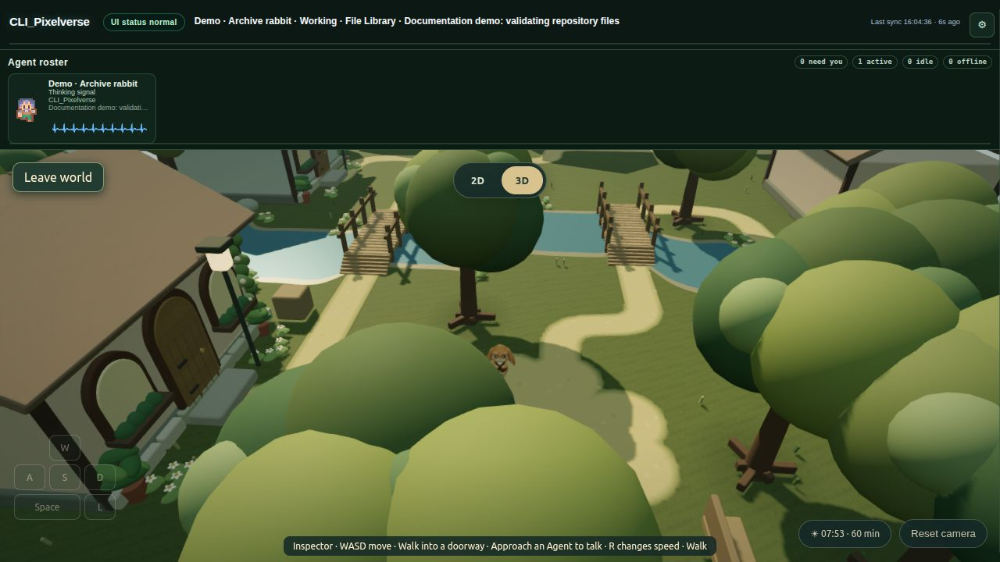
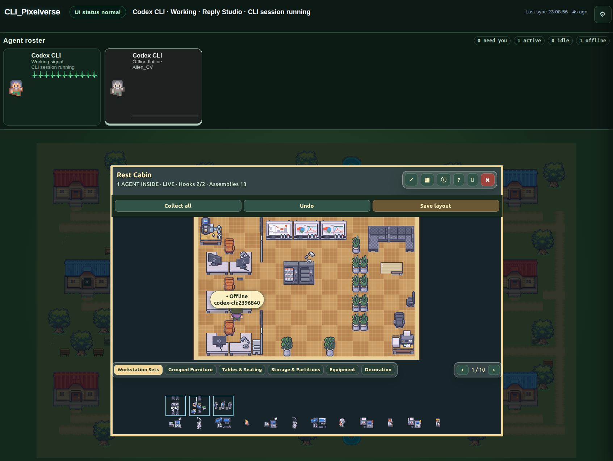
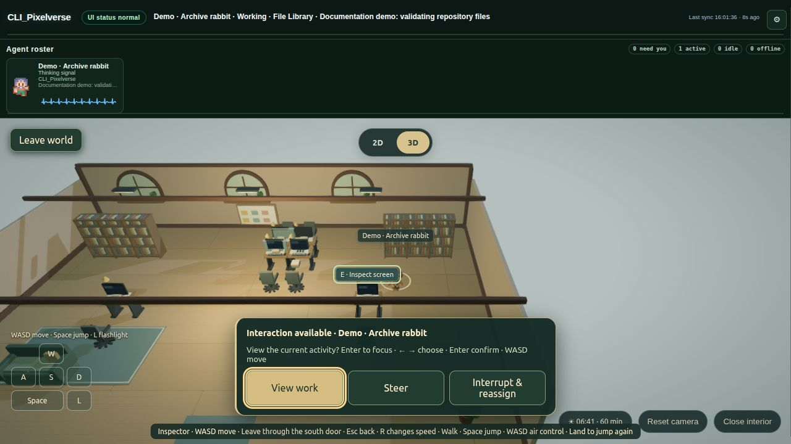
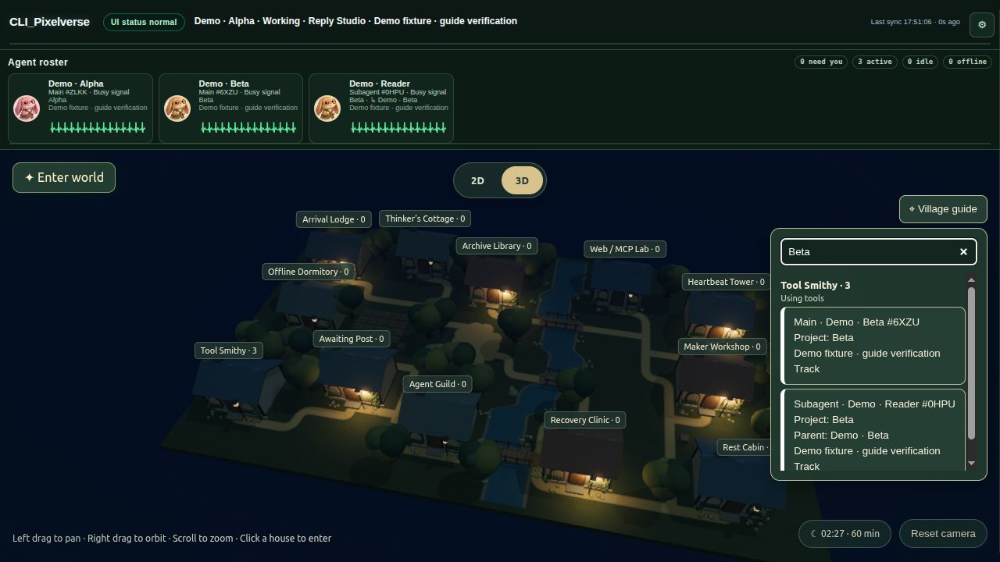
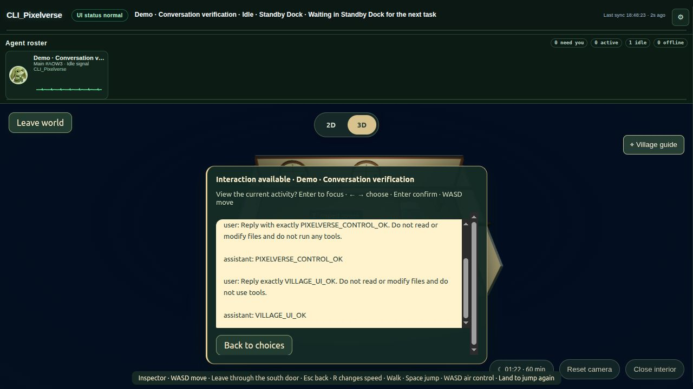

# CLI_Pixelverse

Explore your AI agents at work in a living 3D rabbit village.

CLI_Pixelverse turns real CLI lifecycle and hook events into rabbit characters, rooms, ECG
activity, project-aware roster cards, and inspectable event timelines. It runs
locally with Docker and does not replace your original Agent executables.



*Walk through the village as the inspector. Agent activity determines where rabbits work.*



*Enter furnished rooms, jump onto platforms, and inspect workstation activity.*



*Approach an Agent to view work, steer, or interrupt when a control connection is available. Hook-only Agents expose activity without claiming task-control support.*

Screenshots use a labelled documentation demo in an isolated local instance.
See [verification notes](docs/reference/release-verification.md).

## What You Get

- A 3D village by default, with an optional 2D pixel-art view sharing Agent state.
- An inspector rabbit with WASD movement, R gait cycling, Space jumps and L flashlight.
- Furniture collision, tiered indoor climbing, hourly day/night cycles and meteor arrival.
- Left-drag map panning, right-drag orbit, and cursor-centered wheel zoom.
- View-aware Agent portraits, stable rabbit identity badges, project names, and animated ECG.
- A shared 2D/3D Village guide with live house occupancy, work purpose, and explicit main/subagent links.
- Clickable roster cards with the current task, process, hook, project path, and
  recent events.
- Editable building interiors with furniture collision, placement validation,
  undo, and per-room saved layouts.
- A settings panel for English, Traditional Chinese, Japanese, and Korean UI
  locales, help, connection information, and version details.
- CLI adapters for Codex, Gemini CLI, Claude Code, Antigravity, Ollama, and
  Hermes, plus a generic HTTP event API.
- Localhost, Tailscale, and ngrok exposure modes.

## Find an Agent in the village

Open **Village guide** in either view. Search by Agent name, project, or parent Agent;
occupied houses appear first. House labels show actual indoor occupancy, and hovering
shows the room's purpose and occupants. Select **Track** to keep the target house
highlighted while walking as the inspector. The destination follows the Agent as it moves.

Main and Subagent badges and the same short identity code appear in the roster and
world labels. In 3D, roster portraits use the Honey rabbit appearance. Codex child hooks
report `parent_agent_id` and project metadata; older records without that information
remain unlinked until a new child hook arrives. Other integrations can send these
fields through `/api/event`; sharing a project alone never establishes parenthood.



## Quick Start

### 1. Clone

Prerequisites:

- Docker Engine or Docker Desktop with Docker Compose
- Git and Python 3 (host-side launcher and hook installation)
- At least one supported Agent CLI installed on the host
- No asset purchase is required for the default 3D world.

Clone Pixelverse from any location and derive its path from the current shell:

```bash
git clone https://github.com/a0665x/CLI_Pixelverse.git
cd CLI_Pixelverse
export PIXELVERSE_ROOT="$(pwd -P)"
```

### 2. Start Pixelverse

From the clone root:

```bash
PIXELVERSE_AGENT_KIND=codex ./run.sh --start
```

The first start builds the local image and starts the service using bundled 3D
assets. It does not require Blender, Node.js on the host, or a paid 2D archive.
The first build needs Internet access to download Docker images and dependencies.

`./run.sh start` and `./run.sh --start` are equivalent. If an optional licensed
archive is provided, the launcher prepares it before building. An image with
those paid sprites must not be published to a public registry.

Open [http://localhost:5660](http://localhost:5660), or inspect the resolved
address and saved ports:

```bash
./run.sh status
./run.sh bridge-status
```

### 3. Bind and launch an Agent project

Open a second terminal. Derive the Pixelverse clone path, switch to the project
you want the Agent to manage, then bind and launch:

```bash
cd /path/to/CLI_Pixelverse
export PIXELVERSE_ROOT="$(pwd -P)"
cd /path/to/your-project
"$PIXELVERSE_ROOT/hook_bridge.sh" --agent codex --launch
```

For Codex, run `/hooks` in the first session and trust the generated
project-local hook definition. Binding installs the integration, but it does
not create a fake online Agent: the character appears only after a real CLI session
starts and emits lifecycle activity.

For later shells, either launch through `hook_bridge.sh` again or activate the
repo-local wrappers before using normal CLI commands:

```bash
source "$PIXELVERSE_ROOT/.pixelverse-service/activate.sh"
codex
```

To bind without launching, omit `--launch`:

```bash
cd /path/to/your-project
"$PIXELVERSE_ROOT/hook_bridge.sh" --agent codex
```

## Talk to Codex from the village

For a **shared terminal + village conversation**, run this once inside your project:

```bash
export PIXELVERSE_URL=http://127.0.0.1:5661
/path/to/CLI_Pixelverse/hook_bridge.sh --agent codex --control --launch
```

This starts one Codex App Server session and opens its terminal UI. Click its roster
card to draw a route to the rabbit's house, enter the world, and approach the rabbit.
**View work** shows the session's recent public conversation and command output (up to 60 items). While idle,
**Continue conversation** sends the next message; while working, **Steer** supplements
the current turn and **Interrupt** replaces it after interruption is confirmed.
The character stays in place during the encounter and resumes its route afterwards.
Keep the launcher running. Codex approval settings are preserved; approval prompts
may still require the terminal. This is a conversation viewer, not a raw terminal emulator.

Requirements: a Codex CLI version supporting `--remote` and App Server, an existing
Codex login, and Python 3.11+. The helper installs `websockets` into a local virtual
environment if needed. With Docker, run the helper from the same checkout whose
`.pixelverse-service/runtime` is mounted at `/app/runtime`.

Existing hook-only terminals cannot be silently taken over. Updated hooks publish
public user/assistant history when their JSONL transcript is available. To continue
an older saved session in controllable mode, first exit its original CLI, then run:

```bash
/path/to/CLI_Pixelverse/hook_bridge.sh --agent codex --control --launch --resume YOUR_SESSION_UUID
```

Use the exact session ID shown in Agent details or Codex. Do not resume a different
project's session. Hook-only entries continue to say observation-only until launched
with the shared control connection. History excludes private reasoning and is
fetched on demand instead of being broadcast with every world snapshot.



Protocol reference: [Codex App Server](https://learn.chatgpt.com/docs/app-server).

## Agent Integration Coverage

| Agent | `--agent` value | Integration level |
| --- | --- | --- |
| Codex | `codex` | CLI lifecycle adapter plus project hooks for prompts, tools, subagents, and stop events |
| Gemini CLI | `gemini-cli` | Process start, heartbeat, completion, and error through the CLI adapter |
| Claude Code | `claude-code` | Process start, heartbeat, completion, and error through the CLI adapter |
| Antigravity | `antigravity` | Process start, heartbeat, completion, and error through the CLI adapter |
| Ollama | `ollama` | CLI lifecycle adapter plus selected-model polling |
| Hermes | `hermes` | CLI adapter plus optional Hermes hook, user plugin, and gateway relay |
| Custom Agent | `generic` | Generic HTTP events and heartbeats |

The repository has automated adapter-generation, event-routing, and API
contract tests. Codex has the deepest project-hook integration. Process-level
adapters cannot expose vendor tool calls unless that CLI or another integration
also sends `POST /api/event`.

Launch another installed CLI by changing only the Agent value:

```bash
cd /path/to/your-project
"$PIXELVERSE_ROOT/hook_bridge.sh" --agent claude-code --launch
```

Supported values are `codex`, `gemini-cli`, `claude-code`,
`antigravity`, `ollama`, `hermes`, and `generic`.

### Generic HTTP event

Swagger and the OpenAPI schema are available at
[http://localhost:5660/docs](http://localhost:5660/docs). A minimal tool event:

```bash
curl -X POST http://localhost:5660/api/event \
  -H 'Content-Type: application/json' \
  -d '{"agent_type":"generic","agent":"local-agent","name":"Local Agent","event":"tool.started","tool_name":"terminal","message":"running a command","project_name":"my-project"}'
```

## Everyday Commands

```bash
./run.sh --start          # First start or explicit interactive start
./run.sh restart          # Restart with saved Agent, exposure, and ports
./run.sh stop             # Stop the service
./run.sh status           # Show UI, API, and container status
./run.sh bridge-status    # Check Agent event relay health
./run.sh doctor           # Run connection diagnostics
./run.sh assets-status    # Validate prepared Modern Office assets
./run.sh test-hook        # Send a synthetic lifecycle route
./run.sh logs             # Follow service logs
./run.sh --help
```

Install or refresh adapters explicitly:

```bash
./run.sh adapter codex
./run.sh adapter gemini-cli
./run.sh adapter claude-code
./run.sh adapter antigravity
./run.sh adapter ollama
./run.sh adapter hermes
```

The wrappers live only under `.pixelverse-service/bin/`. They locate and
execute the original CLI, and they still launch it with a warning if Pixelverse
is temporarily unavailable.

## Optional 2D Assets And 3D Attribution

The full 2D office editor uses the separately purchased
[Modern Office - Revamped](https://limezu.itch.io/modernoffice) pack. Put
`Modern_Office_Revamped_v1.zip` in `private_assets/modern-office/`, or run:

```bash
PIXELVERSE_MODERN_OFFICE_ZIP=/absolute/path/to/Modern_Office_Revamped_v1.zip \
  PIXELVERSE_AGENT_KIND=codex ./run.sh --start
```

See [asset preparation](docs/reference/office-assets.md). The ZIP and extracted
sprites are excluded from Git. Without them, use the default 3D view; the 2D
view displays an installation notice and has incomplete office artwork.

Village geometry, furniture and procedural surface textures are authored in
this project. The Honey rabbit was generated with **Meshy**, then rigged and
animated here. Its **CC BY 4.0** attribution must be retained; it is not a
copyright-free asset. See [3D asset credits](pixelworld_mvp/public/assets/honey-meshy/ATTRIBUTION.md).

## Controls

| Input | Action |
| --- | --- |
| WASD | Move and face the direction relative to the camera |
| R | Walk → hop → bound |
| Space | Jump; land before jumping again; climb supported furniture |
| L | Equip / put away the flashlight |
| Left drag / right drag | Pan / orbit the overview |
| Wheel | Zoom; in inspector mode keep the character framed |
| Approach an Agent | Reveal interaction choices without taking movement focus |
| Enter, then ← / → and Enter | Focus the choices, choose, confirm |
| Esc | Close interaction or leave an interior |

## Ports And Remote Access

Defaults:

| Service | Address |
| --- | --- |
| Web UI and API | `http://localhost:5660` |
| API documentation | `http://localhost:5660/docs` |
| World snapshot | `http://localhost:5660/api/world` |
| Hook bridge | `http://localhost:4567/hook` |

Override occupied host ports on first start:

```bash
PIXELVERSE_PORT=5661 \
PIXELVERSE_BRIDGE_PORT=4568 \
PIXELVERSE_AGENT_KIND=codex \
  ./run.sh --start

curl -fsS http://127.0.0.1:4568/health
```

Pixelverse saves successful port choices. `restart`, `hook_bridge.sh`, and
generated activation files reuse them automatically.

For private remote access, set `PIXELVERSE_EXPOSURE_MODE=tailscale` or provide
`PIXELVERSE_NGROK_URL`, then use `./run.sh status` to obtain the published
address. Do not expose the event API publicly without an access-control layer.

## Troubleshooting

### The page does not open

```bash
"$PIXELVERSE_ROOT/run.sh" status
"$PIXELVERSE_ROOT/run.sh" doctor
docker logs --tail 120 cli-pixelverse
```

### The service runs but no Agent appears

1. Start a new CLI process after binding; an already-running process cannot be
   attached retroactively.
2. Confirm the wrapper and bridge:

   ```bash
   source "$PIXELVERSE_ROOT/.pixelverse-service/activate.sh"
   command -v codex
   "$PIXELVERSE_ROOT/run.sh" bridge-status
   ```

3. For Codex, run `/hooks` once in that project and trust the hook.
4. Confirm events arrive:

   ```bash
   "$PIXELVERSE_ROOT/run.sh" test-hook
   curl -fsS http://localhost:5660/api/world
   ```

### Furniture is missing or black

```bash
"$PIXELVERSE_ROOT/run.sh" assets-status
```

If validation fails, restore the purchased ZIP at the documented
`private_assets/modern-office/` path and restart. Do not copy prepared paid
assets into Git.

### A custom Agent CLI is not found

Set the matching executable override before launching, for example:

```bash
PIXELVERSE_CLAUDE_COMMAND=/absolute/path/to/claude \
  "$PIXELVERSE_ROOT/hook_bridge.sh" --agent claude-code --launch
```

Equivalent variables exist for Codex, Gemini, Antigravity, Ollama, and Hermes.

## Development

```bash
PYTHONPATH=. pytest -q
node --test --test-concurrency=1 tests/*.mjs
cd pixelworld_mvp
npm ci
npm test
npm run build
```

Useful release checks:

```bash
bash -n run.sh hook_bridge.sh
./run.sh --test
```

The main components are:

- `run.sh`: service lifecycle, assets, adapters, and diagnostics
- `hook_bridge.sh`: bind a target project and optionally launch its Agent
- `pixelverse_fastapi.py`: API and Swagger application
- `pixelverse_server.py`: world and lifecycle state
- `agent_bridges/`: generic event client and CLI adapter implementation
- `public/`: dashboard shell
- `pixelworld_mvp/`: Phaser village, interiors, movement, and editor
- `tests/`: Python and Node release contracts

The [RPG village presentation guide](./docs/reference/village-art-direction.md)
explains the room presets, palette, furniture geometry, and movement contracts.

## Assets And Licenses

The paid Modern Office pack is not redistributable through this repository.
Purchase it from the
[official LimeZu page](https://limezu.itch.io/modernoffice), keep its original
ZIP private, and build the prepared assets locally.

Bundled redistributable assets retain their license and attribution files under
`pixelworld_mvp/public/assets/`. See
[office asset provisioning](./docs/reference/office-assets.md),
[Pixelworld attribution](./pixelworld_mvp/ATTRIBUTION.md), and
[asset sources](./pixelworld_mvp/public/assets/ASSET_SOURCES.md) before
redistributing a modified build.

### 身歷其境

點村莊左上角「身歷其境」，以召喚空降方式進場，使用 WASD 移動並進出房屋。
靠近 Agent 自動出現「查看工作／插入指令／打斷並改派」，支援滑鼠、左右鍵與 Enter。
Hook-only Agent 可查看工作；真正的 steer / interrupt 必須先綁定本機 Codex App Server。
設定與驗證範圍見 [身歷其境說明](docs/reference/immersion-mode.md)。

2D / 3D views, the shared hourly day/night cycle, zero-cost art sources and controls: [3D village](docs/reference/3d-village.md).
